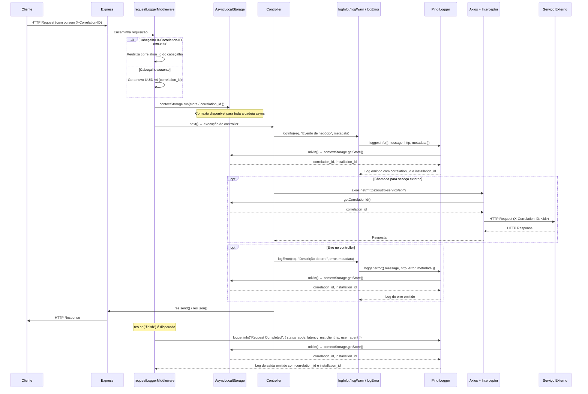

# @fcaioss/observability-lib

> Biblioteca de logging estruturado para aplicações Node.js com Express, baseada em [Pino](https://getpino.io/), com suporte nativo a `correlation_id`, propagação de contexto via `AsyncLocalStorage` e interceptor Axios para ambientes de microserviços.

---

## Documentação

| Arquivo | Conteúdo |
|---|---|
| [README.md](./README.md) | Visão geral, instalação, conceitos e fluxo |
| [usage.md](./usage.md) | Como utilizar: middleware, helpers e Axios |
| [log-schema.md](./log-schema.md) | Estrutura dos logs, boas práticas e tratamento de erros |
| [advanced.md](./advanced.md) | Configuração, observabilidade e tópicos avançados |

---

## Visão Geral

### O que é

`@fcaioss/observability-lib` abstrai a configuração do Pino e adiciona uma camada de contexto automático — especialmente o `correlation_id` — propagado de forma transparente por toda a cadeia de execução de uma requisição, incluindo chamadas externas via Axios.

### Problema que resolve

Em sistemas distribuídos, rastrear uma requisição que passa por múltiplos serviços é difícil sem um identificador comum. Além disso, logs não estruturados tornam inviável a ingestão em ferramentas de observabilidade (Loki, Elasticsearch, etc.).

Esta biblioteca resolve:

- Rastreabilidade de ponta a ponta via `correlation_id` automático
- Logging estruturado em JSON, pronto para ingestão em ferramentas de observabilidade
- Padronização dos logs de entrada e saída de requisições HTTP
- Propagação automática de contexto sem necessidade de passar objetos por toda a pilha de chamadas
- Redação automática de campos sensíveis (autorização, senhas, tokens)

### Principais funcionalidades

- Middleware Express que gera/propaga o `correlation_id` e registra logs de entrada/saída
- `AsyncLocalStorage` para armazenamento de contexto sem acoplamento de parâmetros
- Helpers (`logInfo`, `logWarn`, `logError`, `logFatal`) para uso nos controllers
- Interceptor Axios que injeta automaticamente o `correlation_id` em requisições externas
- Configuração por variáveis de ambiente (`LOG_LEVEL`, `SERVICE_NAME`)
- Redação automática de dados sensíveis via Pino `redact`

---

## Instalação

### Via npm

```bash
npm install @fcaioss/observability-lib
```

> Pacote publicado como `@fcaioss/observability-lib` v`1.1.0`. O ponto de entrada compilado é `dist/index.js`, com tipagens em `dist/index.d.ts`.

### Dependências

As dependências são instaladas automaticamente via npm:

| Pacote    | Versão      |
|-----------|-------------|
| `axios`   | `^1.7.9`    |
| `dotenv`  | `^17.3.1`   |
| `express` | `^4.21.1`   |
| `pino`    | `^10.3.1`   |
| `uuidv4`  | `^6.2.13`   |

Caso a sua aplicação já utilize `axios` ou `express`, verifique a compatibilidade de versões antes de instalar.

### Variáveis de ambiente

| Variável       | Padrão                  | Obrigatória | Descrição                                              |
|----------------|-------------------------|-------------|--------------------------------------------------------|
| `SERVICE_NAME` | `servico-desconhecido`  | Recomendada | Nome do serviço incluído em todos os logs              |
| `LOG_LEVEL`    | `info`                  | Não         | Nível mínimo de log (`info`, `warn`, `error`, `fatal`) |
| `NODE_ENV`     | —                       | Recomendada | Ambiente de execução; habilita avisos de configuração em não-produção |


```env
SERVICE_NAME=meu-servico
LOG_LEVEL=info
```

> **Nota:** O middleware chama `dotenv.config()` automaticamente. Se a sua aplicação já realiza essa chamada antes do middleware, não haverá conflito.

---

## Conceitos Fundamentais

### correlation_id

O `correlation_id` é um identificador único (UUID v4) atribuído a cada requisição HTTP. Ele é incluído em **todos os logs** gerados durante o ciclo de vida daquela requisição e propagado para chamadas externas via cabeçalho `X-Correlation-ID`.

Em uma arquitetura de microserviços, esse ID permite rastrear uma transação de negócio através de múltiplos serviços, mesmo que os logs estejam em sistemas diferentes.

**Origem do `correlation_id`:**

- Se a requisição chega com o cabeçalho `X-Correlation-ID`, esse valor é reutilizado (propagação entre serviços).
- Caso contrário, um novo UUID v4 é gerado pelo middleware.

### AsyncLocalStorage

O `AsyncLocalStorage` (módulo `async_hooks` do Node.js) permite armazenar dados de contexto acessíveis em toda a cadeia assíncrona derivada de uma execução — sem precisar passar parâmetros explicitamente por funções intermediárias.

Nesta biblioteca, um `Map<string, string>` é armazenado no `AsyncLocalStorage` contendo o `correlation_id`. O Pino acessa esse contexto via `mixin` em cada chamada de log, garantindo que o `correlation_id` apareça automaticamente em todos os logs daquela requisição.

```
Requisição → contextStorage.run(store, ...) → toda a cadeia async tem acesso ao store
```

### Logs de infraestrutura vs. logs de negócio

| Tipo               | Gerado por                                           | Exemplo                                             |
|--------------------|------------------------------------------------------|-----------------------------------------------------|
| **Infraestrutura** | Middleware (`requestLoggerMiddleware`)                | `"Request Completed"`                               |
| **Negócio**        | Helpers (`logInfo`, `logWarn`, etc.) nos controllers | `"Pedido criado com sucesso"`, `"CPF inválido"`     |

Os logs de infraestrutura são automáticos e capturam a camada HTTP. Os logs de negócio devem ser adicionados manualmente onde houver eventos relevantes da aplicação.

### Níveis de log

| Nível   | Quando usar                                                             |
|---------|-------------------------------------------------------------------------|
| `info`  | Eventos normais e esperados do fluxo da aplicação                       |
| `warn`  | Situações anômalas que não impedem a operação, mas merecem atenção      |
| `error` | Erros recuperáveis que impactam a operação de uma requisição específica |
| `fatal` | Erros irrecuperáveis que comprometem a disponibilidade do serviço       |

---

## Fluxo Interno do Logger

A seguir, o fluxo completo de uma requisição processada com a biblioteca:

**1. Requisição chega ao Express**

O cliente HTTP envia uma requisição para o servidor. O Express a encaminha para os middlewares registrados.

**2. Middleware extrai ou gera o `correlation_id`**

`requestLoggerMiddleware` verifica o cabeçalho `X-Correlation-ID`. Se presente, reutiliza o valor. Caso contrário, gera um UUID v4 novo com `uuidv4()`.

**3. Contexto é armazenado no `AsyncLocalStorage`**

Um `Map` é criado com a chave `correlation_id` e armazenado no `contextStorage` via `contextStorage.run(store, callback)`. A partir desse ponto, toda execução assíncrona derivada tem acesso ao store.

**4. Controller executa e usa helpers**

O controller recebe `req` e utiliza os helpers (`logInfo`, `logWarn`, `logError`, `logFatal`) para registrar eventos de negócio. O `correlation_id` continua disponível via `AsyncLocalStorage`.

**6. Axios propaga o `correlation_id` para serviços externos**

Se a instância Axios tiver o interceptor aplicado (`applyCorrelationInterceptor`), cada requisição de saída receberá automaticamente o cabeçalho `X-Correlation-ID` com o valor atual do contexto.

**7. Log de saída é registrado**

Quando a resposta é enviada ao cliente, o evento `res.on('finish')` dispara e o middleware registra `"Request Completed"` com `status_code`, `latency_ms`, `client_ip` e `user_agent`.

---

## Diagrama de Sequência



---

## Licença

MIT — consulte o arquivo `LICENSE` no repositório.