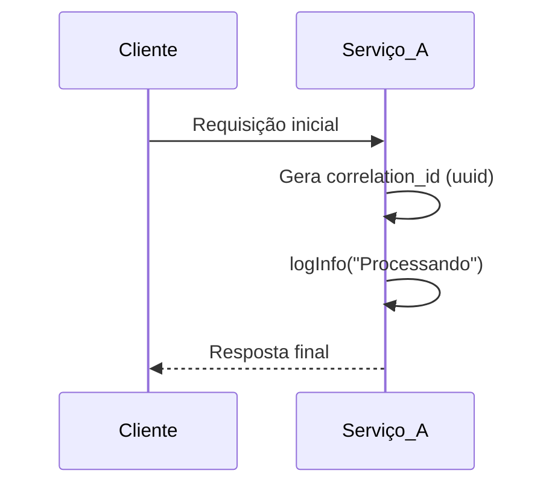
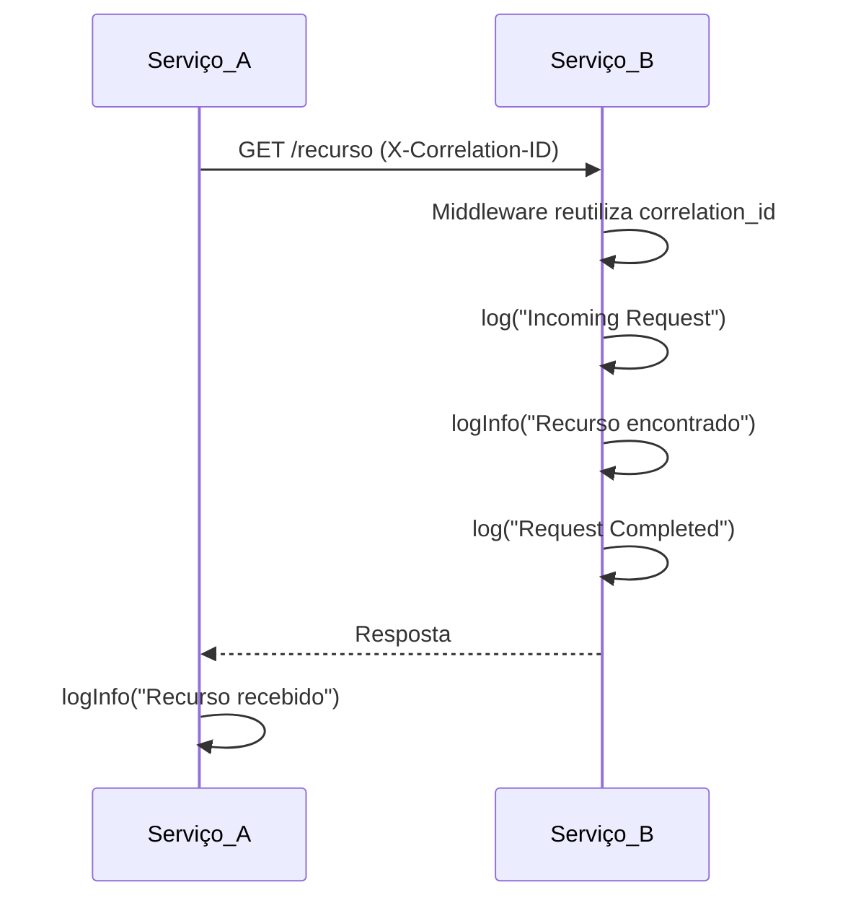

# Como Utilizar
 
> Guia de uso prático da `@fcaioss/observability-lib`. Para conceitos e fluxo interno, veja o [README](./README.md).
 
---
 
## Checklist de Integração
 
Ao integrar a lib em um novo serviço, valide cada item antes de ir a produção:
 
- [ ] `SERVICE_NAME` definido em `.env` ou `docker-compose.yaml`
- [ ] `requestLoggerMiddleware` registrado **antes** de `app.use(router)`
- [ ] Axios interceptor aplicado em todo cliente HTTP: `applyCorrelationInterceptor(httpClient)`
- [ ] Helpers (`logInfo`, `logWarn`, `logError`) usados nos controllers — sem `console.log`
- [ ] `/health` endpoint implementado para healthchecks do Docker
- [ ] `validateIntegration()` chamado no startup para detectar vars de ambiente faltando
 
> Use `validateIntegration()` exportado pela lib para checar automaticamente no startup.
 
---
 
## Middleware
 
O middleware deve ser registrado no Express **antes** de qualquer rota. Ele inicializa o contexto do `AsyncLocalStorage` e é responsável pelos logs de infraestrutura.
 
### ❌ ERRADO — Middleware registrado depois das rotas
 
```typescript
const app = express();
app.use(express.json());
app.use(router);                   // Rotas ANTES
app.use(requestLoggerMiddleware);  // ❌ Middleware DEPOIS — não gera logs para nenhuma rota
app.use(globalErrorHandler);
```
 
**Consequência:** Nenhuma rota gera `"Incoming Request"` ou `"Request Completed"`. O `correlation_id` não é criado e todas as chamadas a helpers (`logInfo`, etc.) não terão `correlation_id` nos logs.
 
### ✅ CORRETO — Middleware registrado antes das rotas
 
```typescript
import express from 'express';
import { requestLoggerMiddleware, validateIntegration } from '@fcaioss/observability-lib';
 
validateIntegration(); // Detecta SERVICE_NAME faltando antes de subir
 
const app = express();
 
app.use(express.json());
app.use(requestLoggerMiddleware);  // ✅ Middleware ANTES das rotas
app.use(router);
app.use(globalErrorHandler);
 
app.listen(3000);
```
 
O middleware realiza automaticamente:
 
- Extração ou geração do `correlation_id` (via cabeçalho `X-Correlation-ID` ou `uuidv4()`)
- Inicialização do `AsyncLocalStorage` com o `correlation_id`
- Log de `"Incoming Request"` com `method` e `url`
- Log de `"Request Completed"` com `status_code`, `latency_ms`, `client_ip` e `user_agent` (via evento `finish` da resposta)
 
---
 
## Exemplo de startup completo
 
```typescript
import express from 'express';
import {
  requestLoggerMiddleware,
  createLogger,
  validateIntegration,
} from '@fcaioss/observability-lib';
import router from './routes';
import { globalErrorHandler } from './middleware/globalErrorHandler';
 
// 1. Detecta problemas de configuração antes de subir
validateIntegration();
 
const logger = createLogger(process.env.SERVICE_NAME || 'my-service');
const app = express();
 
// 2. Middlewares base
app.use(express.json());
app.use(requestLoggerMiddleware);  // ✅ ANTES das rotas
 
// 3. Health check (necessário para Docker healthcheck)
app.get('/health', (req, res) => res.json({ status: 'ok' }));
 
// 4. Rotas de negócio
app.use(router);
 
// 5. Error handler DEPOIS de tudo
app.use(globalErrorHandler);
 
// 6. Inicialização com log estruturado (não console.log)
const PORT = process.env.PORT || 3000;
app.listen(PORT, () => {
  logger.info({ message: 'Server listening', port: PORT });
});
```
 
---
 
## createLogger
 
A função `createLogger(serviceName)` cria uma instância Pino configurada com todas as opções da biblioteca (mixin, redact, formatters, etc.).
 
```typescript
import { createLogger } from '@fcaioss/observability-lib';
 
const logger = createLogger('meu-servico');
logger.info({ message: 'Servidor iniciado', port: 3000 });
```
 
**Quando usar diretamente:**
 
- Para logar eventos de inicialização do servidor (antes de qualquer requisição)
- Para logar eventos de infraestrutura sem uma requisição HTTP associada (ex: conexão com banco de dados)
 
**Quando NÃO usar:**
 
Dentro de controllers ou handlers de rota. Nesses contextos, sempre prefira os helpers (`logInfo`, `logWarn`, etc.) — eles incluem os dados HTTP (`method`, `url`) de forma padronizada e automática.
 
---
 
## Helpers (com req)
 
Os helpers constroem o payload de log de forma padronizada, incluindo os dados HTTP da requisição atual. Todos aceitam o objeto `req` do Express como primeiro argumento.
 
---
 
### `logInfo`
 
```typescript
logInfo(req: Request, message: string, metadata?: Record<string, any>): void
```
 
Registra um evento informativo do fluxo normal da aplicação.
 
```typescript
import { logInfo } from '@fcaioss/observability-lib';
 
app.get('/pedidos/:id', async (req, res) => {
  const pedido = await buscarPedido(req.params.id);
  logInfo(req, 'Pedido recuperado com sucesso', { pedido_id: req.params.id });
  res.json(pedido);
});
```
 
**Quando usar:** Confirmação de operações bem-sucedidas, eventos relevantes do fluxo de negócio.
 
---
 
### `logWarn`
 
```typescript
logWarn(req: Request, message: string, metadata?: Record<string, any>): void
```
 
Registra uma situação anômala que não impede a continuidade da operação, mas que merece monitoramento.
 
```typescript
import { logWarn } from '@fcaioss/observability-lib';
 
app.post('/usuarios', async (req, res) => {
  if (!req.body.email) {
    logWarn(req, 'Tentativa de criação de usuário sem e-mail', {
      body_recebido: Object.keys(req.body),
    });
    return res.status(400).json({ error: 'E-mail obrigatório' });
  }
  // ...
});
```
 
**Quando usar:** Validações que falharam, dados ausentes ou inconsistentes, comportamento inesperado mas recuperável.
 
---
 
### `logError`
 
```typescript
logError(req: Request, message: string, error: unknown): void
logError(req: Request, message: string, error: unknown, metadata: Record<string, any>): void
```
 
Registra um erro que impactou a operação de uma requisição específica.
 
```typescript
import { logError } from '@fcaioss/observability-lib';
 
app.get('/dados', async (req, res) => {
  try {
    const dados = await buscarDadosExternos();
    res.json(dados);
  } catch (err) {
    logError(req, 'Falha ao buscar dados externos', err);
    // Com metadata adicional:
    // logError(req, 'Falha ao buscar dados externos', err, { endpoint: '/api/dados' });
    res.status(502).json({ error: 'Serviço indisponível' });
  }
});
```
 
### ❌ Erro comum — passar { error: err } no lugar de err
 
```typescript
// ERRADO — fica duplamente aninhado no log: error: { error: { message: '...' } }
logError(req, 'Falha', { error: err });
 
// CORRETO — pino.stdSerializers.err extrai type, message e stack corretamente
logError(req, 'Falha', err);
```
 
**Quando usar:** Exceções capturadas em `try/catch`, falhas de integração com APIs externas, erros de acesso a banco de dados.
 
---
 
### `logFatal`
 
```typescript
logFatal(req: Request, message: string, error: unknown): void
logFatal(req: Request, message: string, error: unknown, metadata: Record<string, any>): void
```
 
Registra um erro crítico que compromete a disponibilidade do serviço.
 
```typescript
import { logFatal } from '@fcaioss/observability-lib';
 
app.post('/critico', async (req, res) => {
  try {
    await operacaoCritica();
  } catch (err) {
    logFatal(req, 'Falha crítica na operação de pagamento', err, {
      transacao_id: req.body.transacao_id,
    });
    res.status(500).json({ error: 'Erro interno crítico' });
  }
});
```
 
**Quando usar:** Falhas que exigem intervenção imediata, corrupção de dados, indisponibilidade de dependências críticas.
 
---
 
## Helpers de background (sem req)
 
Para workers, cron jobs e eventos assíncronos que não têm uma `Request` HTTP associada.
 
```typescript
import {
  logInfoBackground,
  logWarnBackground,
  logErrorBackground,
  logFatalBackground,
  runWithCorrelationId,
  runWithNewCorrelationId,
} from '@fcaioss/observability-lib';
 
// Executa o worker dentro de um contexto com correlation_id próprio
runWithNewCorrelationId(async () => {
  logInfoBackground('Email job started', { batch_size: 100 });
 
  try {
    await sendEmails();
    logInfoBackground('Email job finished', { sent: 100 });
  } catch (err) {
    logErrorBackground('Email job failed', err, { batch_size: 100 });
  }
});
```
 
O `correlation_id` é injetado automaticamente via `AsyncLocalStorage` em todos os logs dentro do escopo de `runWithNewCorrelationId` ou `runWithCorrelationId`.
 
**Assinaturas disponíveis:**
 
```typescript
logInfoBackground(message: string, metadata?: Record<string, any>): void
logWarnBackground(message: string, metadata?: Record<string, any>): void
logErrorBackground(message: string, error?: unknown, metadata?: Record<string, any>): void
logFatalBackground(message: string, error?: unknown, metadata?: Record<string, any>): void
 
runWithCorrelationId<T>(correlationId: string, fn: () => T): T
runWithNewCorrelationId<T>(fn: () => T): T
```
 
---
 
## Interceptor Axios
 
Para propagar o `correlation_id` em chamadas HTTP para outros serviços, aplique o interceptor na instância Axios:
 
```typescript
import axios from 'axios';
import { applyCorrelationInterceptor } from '@fcaioss/observability-lib';
 
const httpClient = axios.create({
  baseURL: 'https://api.outro-servico.com',
  timeout: 5000,
});
 
applyCorrelationInterceptor(httpClient);
 
export { httpClient };
```
 
A partir desse ponto, toda requisição feita com `httpClient` incluirá automaticamente o cabeçalho `X-Correlation-ID` — **desde que a chamada aconteça dentro do escopo de uma requisição Express com o middleware registrado.**
 
### Propagação entre microserviços
 
**1. Geração do `correlation_id` no serviço de entrada:**



**2. Propagação para serviços downstream:**



 
Todos os logs dos dois serviços compartilham o mesmo `correlation_id`, permitindo rastrear a transação completa em uma única query no sistema de logs.
 
### Serviços receptores
 
Para que um serviço receptor reutilize corretamente o `correlation_id` vindo de outro serviço, basta ter o `requestLoggerMiddleware` registrado — ele já lê o cabeçalho `X-Correlation-ID` automaticamente.
 
---
 
## validateIntegration
 
Valida variáveis de ambiente obrigatórias e recomendadas. Emite warnings em stdout se algo estiver faltando.
 
```typescript
import { validateIntegration } from '@fcaioss/observability-lib';
 
// No startup, antes de qualquer outra coisa
const { valid, warnings } = validateIntegration();
 
if (!valid) {
  // warnings já foram impressos em stdout pelo validateIntegration
  // Você pode também tratar programaticamente:
  warnings.forEach(w => console.warn(w));
}
```
 
**Checks realizados:**
 
| Var | Obrigatória | Impacto se ausente |
|---|---|---|
| `SERVICE_NAME` | Recomendada | Logs aparecem como `servico-desconhecido` no Loki |
| `NODE_ENV` | Recomendada | Comportamentos de dev/prod podem não funcionar corretamente |
